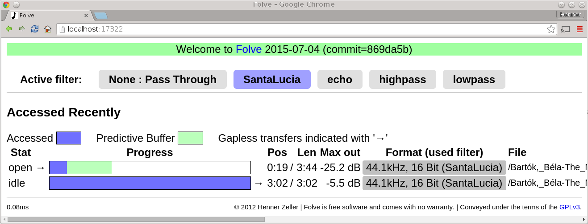
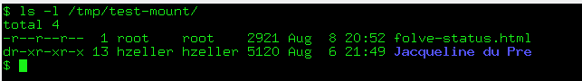
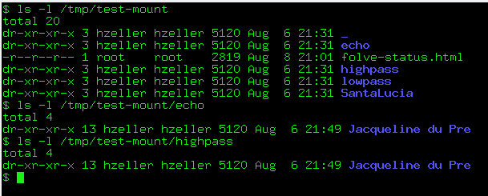
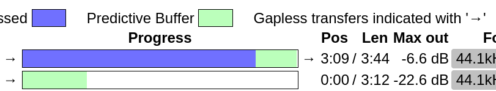

Folve - FUSE convolve
=====================
Folve is a FUSE filesystem that convolves audio files on-the-fly including
gapless support.

Need to have precision-filtered audio adapted for your speakers and room (or just
for effects), but your audio system doesn't have plug-ins for Finite-Impulse-Response
filters and just can read files ? Folve is for you!

Filter selection and general status provided via web interface.



Overview
--------

Folve provides a filesystem that convolves files on-the-fly as a media server
or application reads them. This helps in cases where media servers or
applications do not provide an independent convolve option, but only can read
files.

The Folve FUSE filesystem takes a path to a directory of FLAC files, and provides
these files at a mount point. Other file formats than FLAC should work as well,
but not all are working well for streaming yet (and before you ask: MP3 is not
supported. Use Ogg/Vorbis as it is patent free and provides better quality
than MP3).

When a FLAC file is accessed through the mount point, Folve automatically
convolves its original counterpart on-the-fly with a Finite Impulse
Response (FIR) filter. The FIR filter is based on Fons Adriaensen's
jconvolver convolution engine (zita convolver).

### Compiling ###
Tested on Ubuntu, various Debian versions and the common Debian version on
the Raspberry Pi.

For compilation, we need some development libraries, easiest to install
via the package manager:

    sudo apt-get install fuse libflac-dev libzita-convolver-dev \
                         libfuse-dev libmicrohttpd-dev libsndfile-dev
    # Now just compile folve.
    make
    sudo make install

For hints on how to compile on older systems see [INSTALL.md](./INSTALL.md).

----

#### libsndfile-dev

libsndfile is distributed on debian systems in version 1.0.28.
There is a problem with flac-header handling in that version that
resulted in a folve [issue](https://github.com/hzeller/folve/issues/1).
It is worked around in folve now to an extend, but it is better to get the
[fixed](https://github.com/erikd/libsndfile/pull/307) upstream sndfile
development version.
However, that has not been released yet as new version number. So it is best to
[compile the latest libsndfile from git](https://github.com/erikd/libsndfile)
and use that.

---

Sometimes, running folve complains that it can't access `/dev/fuse`. In that
case, you need to put your user into that group
`sudo usermod -G fuse $USER` (then open new shell or reboot). Or you can run
folve as root.

(TODO: create a debian package)

### Let's test it! ###
Folve requires at least two parameters: the directory where your original
FLAC files reside and the mount point of this filesystem.

Also, do be useful, you need to supply the directory that contains filter
directories with the `-C <config-dir>` option.
Very useful is the `-p <port>` that starts a HTTP status server. Let's use
some example filters from this distribution.
If you are in the Folve source directory, you find the directory `demo-filters/`
that contains subdirectories with filters. If we pass this directory to folve,
folve will search in this directory for named filters:

    mkdir /tmp/test-mount
    ./folve -f -C demo-filters -i SantaLucia -p 17322 \
            /path/to/your/directory/with/flacs /tmp/test-mount

The `-f` option makes folve run in the foreground.

Now you can access the fileystem under that generated mount point
`/tmp/test-mount`; it has the same structure as your original directory.
So in another shell, you can now run any music player that reads files
and point it to the new location:

    mplayer /tmp/test-mount/foo.flac

Folve provides a HTTP status page; have a look at

    http://localhost:17322/

(or whatever port you chose with the `-p 17322` option)

In the status page, you can switch the filter; after you changed it in the
UI, re-open the same FLAC file with your media player: you'll hear the
difference.

Check out the included SantaLucia filter for instance: all your music now
sounds like it was played in a huge church! In fact, the FIR filter was
created by recording an impulse response (read: gun shot) in the Santa Lucia
Basilica in Bologna, Italy.

To terminate this instance of folve, you can just press CTRL-C as we've run it
in the foreground (the `-f` option did this). In real life, you'd run it as
daemon (without `-f` option), so then you can stop the daemon and unmount the
directory with the `fusermount` command:

    fusermount -u /tmp/test-mount

### Filter switching or filtered directory
There are two modes in which you can operate `folve` in: filter switching or
filtered directory.

#### Filter switching ####
The default mode is to mirror the original directory structure at the toplevel
of the mount point. If you have multiple filters configured, you then can
change the currently active filter via the web-frontend (whose port you
choose with the `-p` option). There are tabs at the
top of the page that allow to choose the current filter:


The mounting point directory looks like the original directory:



(You also see, that there is a `folve-status.html` file in the toplevel
directory, which show a readonly version of the status page also served via
the web-server).

This is typically the most useful mode: you present a single directory
structure to the music player or server which it only has to index once.
You then can choose to change the filter at runtime. Files opened after
such change will have the new filter applied.

#### Filtered directory ####

You can also choose to have the different filtered versions show up in
different toplevel directories; choose this with the `-t` option:

```
-t           : Filternames show up as toplevel directory instead
               of being switched in the HTTP status server.
```



The toplevel directory contains names that are named like the available filters.
Under each of these filter-directories, the original directory is mirrored. You
choose the filter by playing the audio file in the corresponding directory.

There is one special directory `_` (underscore) that contains the unfiltered
content.

This mode is useful to do comparisons between different versions simply
by comparing the same file in differnt directories. It is also needed if
you want to use multiple filters concurrently without one global mode switch.
For music indexing applications (e.g. mpd, amarok) this mode might be
confusing as it finds the exact piece of music multiple times for each filter
you have configured.

### Filter Configuration ###
With the uppercase `-C` option, you give folve a directory in which it looks for
subdirectories with named filter configurations. See
the example [`demo-filters/`](./demo-filters) in this project.

Filters are WAV files containing an impulse response (IR). This is
used by jconvolver's convolution engine to create a
[Finite Impulse Response](http://en.wikipedia.org/wiki/Finite_impulse_response)
(FIR) filter and process your audio.

Text configuration files refer to these WAV files and add parameters such as
filter gain and channel mapping. These configuration files are read by Folve.
See the samples in the `demo-filters/` directory. The
[README.CONFIG](./README.CONFIG.txt) describes the detailed configuration
options. To make it easier for everyone already using
[jconvolver] or fconvolver, folve uses the same configuration format.

Since the filter is dependent on the sampling rate, we need to choose the right
filter depending on the input file we see. This is why you give Folve a whole
configuration directory: it can contain multipe files depending on sample rate.

The files in the configuration directory need to follow a naming scheme to
be found by Folve. Their naming is:

    filter-<samplerate>-<channels>-<bits>.conf   OR
    filter-<samplerate>-<channels>.conf          OR
    filter-<samplerate>.conf

So if you have FLAC files with 44.1kHz, 16 bits and 2 channel stero,
you need a filter configuration named one of these (in matching sequence):

    /filter/dir/filter-44100-2-16.conf            OR
    /filter/dir/filter-44100-2.conf               OR
    /filter/dir/filter-44100.conf

The files are searched from the most specific to the least specific type.

The Folve filesystem will determine the samplerate/bits/channels and
attempt to find the right filter in the filter directory. If there is a filter,
the output is filtered on-the-fly, otherwise the original file is returned.

(I am looking for filter construction tools on Linux; if you know some,
please let me know.)

### Gapless joining ###
In gapless playback the media players make sure that there is no audible gap
between playing one file and the next, by joining the last waveform sample of
the last file with the first of the next.
(If you never heard this term, it is mostly useful for recording of concerts
where there is one continuous recording that are logically separated in tracks,
but there is no pause - or gap - between these tracks).

Gapless convolving in folve needs to do that as well; however it needs to predict
what file the player is about to open. On the filesystem layer it can't definitiely
know what that would be. However by common convention, files that are
consecutive are alphabetically sorted in the fileysten
(`01-foo.flac`, `02-bar.flac`..).
With that heuristic, folve can provide reliable gapless convolving.

You can switch it on with the `-g` option:

    ./folve -C demo-filters -p 17322 -g \
            /path/to/your/directory/with/flacs /tmp/test-mount

Of course, you need to make sure to use players that can do gapless playback.
In our older versions of mplayer you need to use the `--gapless-audio` option to
make use of it, in your audio player you need to look what that equivalent is
(some support it right out of the box).

In the folve web-frontend, you see the gapless joining with little arrows `->`.
You also see that folve already startes pre-buffering the beginning of the
next file while it still plays the previous one:



### General usage: ###
```
usage: ./folve [options] <original-dir> <mount-point-dir>
Options: (in sequence of usefulness)
        -o <mnt-opt> : Fuse mount parameters (see man mount.fuse).
        -C <cfg-dir> : Convolver base configuration directory.
                       Sub-directories name the different filters.
                       Select on the HTTP status page.
        -t           : Filternames show up as toplevel directory instead
                       of being switched in the HTTP status server.
        -i <filter>  : Name of filter to start with if -t is not given
        -p <port>    : Port to run the HTTP status server on.
        -r <refresh> : Seconds between refresh of status page;
                       Default is 10 seconds; switch off with -1.
        -g           : Gapless convolving alphabetically adjacent files.
        -b <KibiByte>: Predictive pre-buffer by given KiB (64...16384). Disable with -1. Default 128.
        -O <factor>  : Oversize: Multiply orig. file sizes with this. Default 1.25.
        -P <pid-file>: Write PID to this file.
        -D           : Moderate volume Folve debug messages to syslog,
                       and some more detailed configuration info in UI
        -f           : Operate in foreground; useful for debugging.
        -d           : High volume FUSE debug log. Implies -f.
        -R <file>    : Debug readdir() & stat() calls. Output to file.
```

The mount options `-o` allow you to tweak how the file-system is mounted.
For instane if the user starting folve (let's say `daemon`) is different from
the user accessing the files, you might need the `allow_other` option.

If you're listening to classical music, opera or live-recordings, then you
certainly want to switch on gapless convolving with `-g`. If a file ends with
not enough samples to fill the FIR filter input, the gap is bridged by
including the first samples of the alphabetically next file in that
directory -- and the result is split between these two files.

The buffer size `-b` flag tells folve how much it should attempt to pre-convolve
a file if CPU permits. The default setting is pretty minimial; you typically want
this to be at or above 1024, in particular if your player reading from the
filesystem does not do a good job of pre-buffering itself.

### Misc ###
To switch the configuration manually or from a script instead of the
status page, you can use `wget` or `curl`, whatever you prefer:

    wget -q -O/dev/null http://localhost:17322/settings?f=highpass
    curl http://localhost:17322/settings?f=SantaLucia

The parameter given to `f=` is the name of the subdirectory in your base
configuration directory. An empty string is no filter, i.e. 'pass through'.
(And no, there is no security built-in. If you want people from
messing with the configuration of your Folve-daemon, do not use `-p <port>` :)).

### Shortcomings ###

There is one problem with online rewriting compressed files: we don't know
what the final size of the file will be as the content will be different.

Folve can't know the correct filesize before it has it processed, but it has
to return something in an `ls -l` or when a streaming program is asking for
the size of a file (the `stat()` call).
In this case it has to report an estimated value; it tries to err on the
large size: report a larger size than we might end up with. It
derives this from the input file size and multiplies it with some factor. The
`-O` flag determines that factor. By default that is 1.25, so Folve will report
a size that is 25% larger than the original as long as it doesn't know anything
more.

While convolving it will get a better estimate of the final file-size, in
particular when it finished the file. It will adjust the size as it
is being refined, but it will only report larger sizes than shown initially (so
size will always be reported at least 25% larger, even if the resulting file
turns out to be 50% smaller).
Empirically, it is better to over-report the file size than returning a too
small value. Reporting smaller values means that many programs stop reading
early, while they are fine if the file is smaller than expected.

This usually is not a problem if the reading program behaves
well with a zero return code of `read()` that indicates end-of-file.
If they don't, you'd typically see as symptom a large amount of CPU use
of the reading program and an `strace` will show repeated read calls beyond
the end of file. It is worthfile making these read routines more resilient.
For instance here is a pending [minidlna patch] that does that.

So the heuristic Folve applies might make it fragile for some programs that
rely on the reported size. This can certainly be improved. For instance,
we could always emit non-compressed flac files and thus would be able to
exactly calculate the file-size from the number of samples. This would blow
up the file sizes of course, which is not so much of a problem for storage (as
all the converted files are ephemeral while being convolved), but
for streaming: files streamed from there will impose more network traffic.

If you run into such a problem that might be related to the reported size,
please file an issue that explains what happens. Maybe we can work on a better
heuristic in that case, actually implement the non-compression flac and/or
make the consuming program more resilient if possible (like the minidlna patch
mentioned above).

## Details ##
Filesystem accesses are optimized for streaming. If files are read sequentially,
we only need to convolve whatever is requested, which minimizes CPU use if
you do not need the full file. Simply playing a file in real-time will use very
little CPU (on my fairly old notebook ~3% on one core). So this should work as
well on low-CPU machines; on a fairly old Raspberry Pi 2, the CPU load to
convolve a 44.1kHz/16 Bit file is about 22%. Folve can make use of multiple
cores in parallel file accesses.
Many NAS systems have enough CPU to transparently run folve even for
sophisticated filters.

Because input and output files are compressed, we cannot predict what the
relationship between file-offset and sample-number is; so skipping forward
requires to convolve everything up to the point (the convolver is pretty fast
though, so you'll hardly notice).

While indexing, some media servers try to skip to the end of the file (do not
know why, to check if the end is there ?), so there is code that detects this
case so that we do not end up convolving whole files just for this. Also, some
media servers continually watch the file size while playing, so we adapt
predictions of the final filesize depending on the observed compression ratio.

The files are decoded with libsndfile, convolved, and re-encoded with
libsndfile. Libsndfile is very flexible in reading/writing all kinds
of audio files, but the support for rich header tags is limited. To not loose
information from the FLAC headers when indexing Folve-served files with a
media server, Folve extracts and serves the headers from the original files
before continuing with the convolved audio stream.

Folve has been tested with some players and media servers (and
works around bugs in these). Please report strange observations with particular
media servers or provide patches through github
<https://github.com/hzeller/folve>.

## Project dependencies ##

This project is notably based on

 * FUSE: Filesystem in Userspace   <https://github.com/libfuse/libfuse>
 * Zita Convolver <http://kokkinizita.linuxaudio.org/linuxaudio/downloads/zita-convolver-4.0.3.tar.bz2>  (also compatible with 3.1.0 version).
 * JConvolver <http://apps.linuxaudio.org/apps/all/jconvolver>
     * Program files in the Folve project named zita-*.{h,cc} are derivatives of
       files found in the jconvolver 0.9.2 project. They implement
       the compatible configuration file parsing.
 * LibSndfile r/w audio files <http://www.mega-nerd.com/libsndfile/>
 * Microhttpd webserver library <http://www.gnu.org/software/libmicrohttpd/>


[jconvolver]: http://apps.linuxaudio.org/apps/all/jconvolver
[minidlna patch]: https://sourceforge.net/u/hzeller/minidlna.fork/ci/630ccd27d546aa434301139d12545750d021f5db/